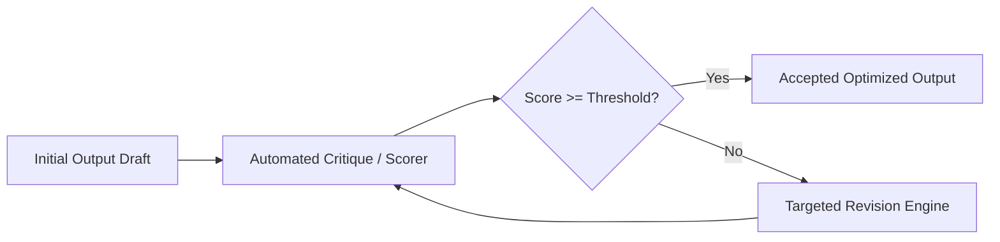

# Self-Refine Iterative Critique Optimization Skill

High-efficiency, zero-dependency Python implementation of **Self-Refine: Iterative Refinement with Self-Feedback**.

## Features
- **Iterative Feedback Loop**: Interleaves generation, automated rubric critique, and targeted revision.
- **Convergence Guarantees**: Terminates early upon attaining quality score thresholds or hitting max iteration budgets.
- **Zero External Dependencies**: Pure Python standard library.
- **Native MCP Protocol**: JSON-RPC 2.0 stdio server compatible with Claude Desktop, Cursor, and Windsurf.

## Architecture

